# DevTinder

[](https://github.com/abhisheksajwan07/DevTinder/actions/workflows/ci.yml)

<p align="center">
  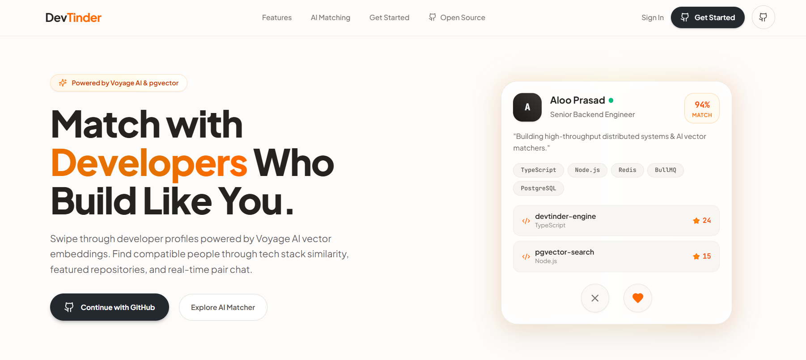
</p>

DevTinder is a full-stack networking application for developers. It combines a swipe-style discovery experience with developer profiles, optional GitHub data, semantic recommendations, connection requests, and private real-time conversations.

## Highlights

- Guided onboarding captures role, experience, availability, skills, interests, collaboration goals, avatar, and an optional GitHub connection.
- A personalized feed uses stored profile embeddings to rank completed profiles by similarity and excludes profiles either participant has already acted on.
- Connection requests can be accepted or rejected. Acceptance is processed asynchronously into a match and private conversation.
- Real-time messaging includes presence, typing indicators, read receipts, keyset cursor pagination for message history, offline email notifications, and membership checks.
- Authentication supports email/password plus Google and GitHub OAuth, with email verification, password reset, session management, and selective or global session revocation.
- GitHub profile and repository data can be synchronized in the background; users can feature up to three repositories.

## Architecture

### Layered Backend Architecture

The Express API is organized by feature. Routes compose the middleware relevant to an endpoint; controllers translate HTTP concerns; services implement use cases; repositories own database and Redis access. Validators sit at the route boundary, and dependency modules assemble concrete service/repository instances.

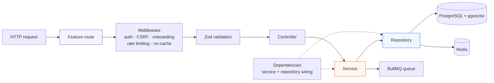

Feature modules cover auth, sessions, OAuth, onboarding, feed, swipes, matches, chat, GitHub, profiles, and Socket.IO. Cross-cutting middleware adds Helmet, CORS, structured HTTP logging, metrics, error handling, and Redis-backed limits.

### System Architecture

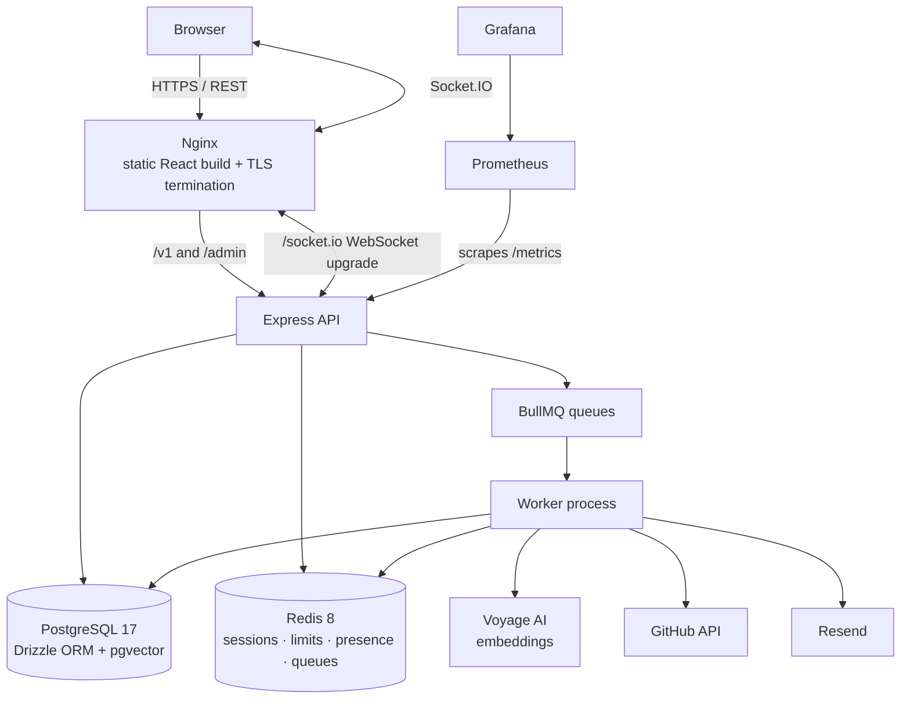

The React 19/Vite client uses React Query for server state, Zustand for auth state, route guards for public, verified, onboarding, and authenticated areas, and Socket.IO hooks for chat. Nginx serves the production build and proxies REST, Bull Board in non-production, and Socket.IO traffic to the API.

### Background Jobs

BullMQ keeps external I/O and post-request work out of latency-sensitive handlers. The API and worker run as separate Compose services and share Redis queues.

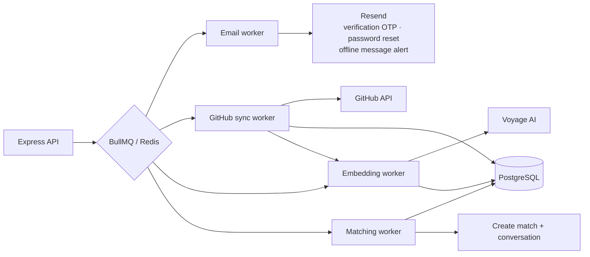

- **Embeddings:** onboarding/profile changes enqueue a job. The worker builds a profile corpus, requests a 1,024-dimensional Voyage embedding, and stores it in pgvector. An embedding version check prevents an older job from replacing newer profile data.
- **GitHub sync:** the worker fetches the GitHub profile and repositories, stores the result, then queues a fresh embedding. Manual sync has a Redis per-profile cooldown to prevent duplicate external calls.
- **Email:** verification OTP, password-reset delivery, and offline chat message alerts run through Resend. Offline alerts check recipient presence in Redis and use a deduplicated job ID to prevent notification spam. Reset jobs carry an idempotency key so retries represent the same send attempt.
- **Matching:** accepting a pending connection queues match and conversation creation, with exponential retry configuration on the queue.

### Production and CI/CD Architecture

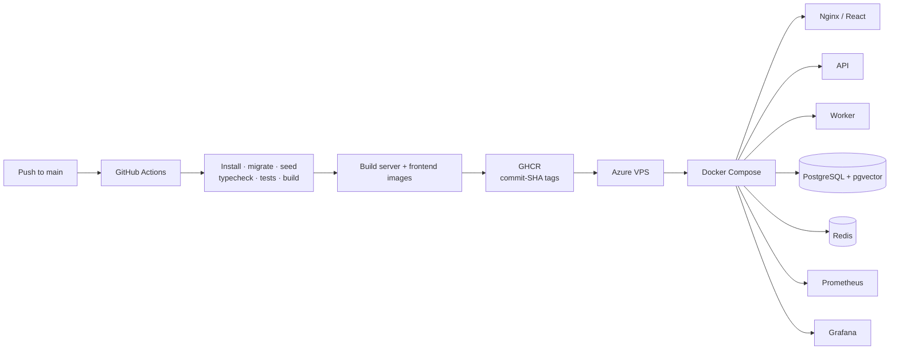

On a successful push to `main`, GitHub Actions runs the server checks against PostgreSQL and Redis, builds the server and frontend images, and publishes both to GHCR using the commit SHA as the image tag. The deploy job connects to the VPS, pulls deployment configuration and images, runs Compose (including migrations), then checks `/health`. A manual rollback workflow redeploys a specified known-good SHA-tagged image.

### Important Request and Data Flows

#### Authentication and sessions

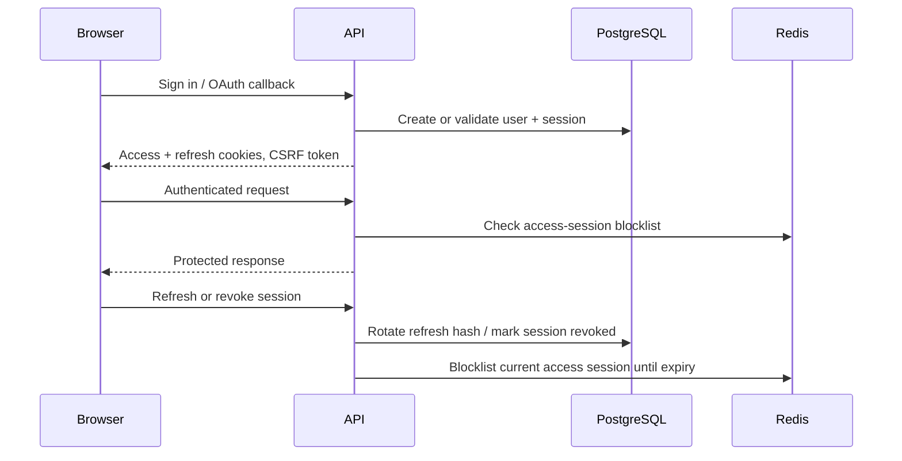

Passwords are bcrypt hashes. Refresh tokens are stored as hashes and rotated; state-changing cookie flows require a matching CSRF cookie/header. Route-specific limits, account lockout after repeated failed sign-ins, and AES-256-GCM encryption for stored OAuth tokens provide additional layers of protection.

#### Feed and embedding lifecycle

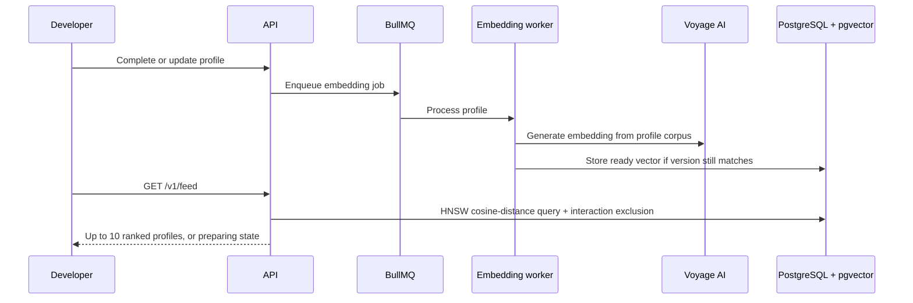

The feed only considers ready embeddings and completed profiles. It uses pgvector cosine-distance ordering with an HNSW index and indexed `NOT EXISTS` checks in both directions to exclude previous profile actions.

#### Real-time chat

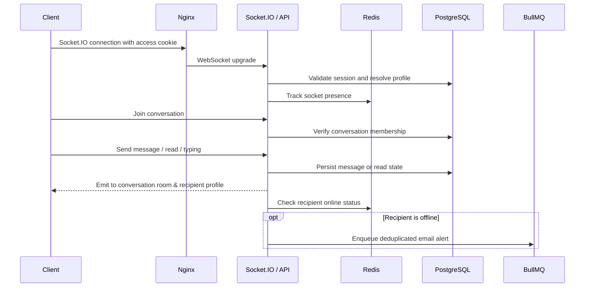

Each socket authenticates from the access-token cookie. A client must pass membership validation before it can join a conversation; send, read, and typing events require that joined room. Redis tracks multiple socket IDs per profile so presence remains accurate across tabs. When a new message arrives for an offline participant, the socket handler triggers a background BullMQ job to notify the recipient via email without blocking the socket acknowledgment.

## Core Engineering Decisions

### Semantic recommendations without a blocking request path

Embedding generation happens in a dedicated worker rather than during onboarding or profile updates. This keeps writes responsive and makes the UI’s explicit feed-preparing state meaningful. The versioned update guards against stale job output, while the query remains bounded to ten candidates.

### Explicit async boundaries

Jobs handle email, GitHub synchronization, embeddings, and match/conversation creation. The design keeps HTTP handlers focused on request validation and durable state changes, while retries, concurrency, and provider-specific pacing live with the worker.

### Security designed into normal flows

The project layers cookie-based access control, hashed and rotating refresh tokens, revocation blocklists, CSRF checks, CORS origin allowlisting, Helmet, rate limits, account lockout, and encrypted OAuth token storage. The same session validity is checked when a Socket.IO connection is established.

### Chat authorization and resilient delivery

Conversation access is verified in the API and again when joining a socket room. Messages are persisted before broadcast; participants not currently in the active conversation room still receive a targeted profile-room event so their global conversation list can update unread counters, while avoiding redundant emissions to the sender. When a message is sent to an offline recipient, an out-of-band notification job is enqueued in BullMQ with a stable job ID (`notify-{profileId}`) to prevent email flooding while keeping socket acknowledgments sub-millisecond.

### Keyset cursor pagination and scroll stabilization

Both conversation lists and message histories use keyset cursor pagination (`cursor`, `limit`) backed by composite indexes rather than offset-based queries, preventing performance degradation on high-volume conversations. The React client pairs `useInfiniteQuery` with a top-sentinel `IntersectionObserver` and scroll-height delta compensation, prepending older message chunks without layout shifts or viewport jumpiness.

## Tech Stack

| Area                   | Implementation                                                                                     |
| ---------------------- | -------------------------------------------------------------------------------------------------- |
| Client                 | React 19, TypeScript, Vite, React Router, Tailwind CSS, React Query, Zustand, React Hook Form, Zod |
| API                    | Node.js, TypeScript, Express 5, Zod, Pino                                                          |
| Data                   | PostgreSQL 17, pgvector, Drizzle ORM and migrations                                                |
| Realtime and jobs      | Socket.IO, Redis 8, BullMQ                                                                         |
| Integrations           | Google OAuth, GitHub OAuth/API, Resend, Voyage AI embeddings                                       |
| Quality and operations | Vitest, Supertest, k6, Docker Compose, Nginx, Prometheus, Grafana, GitHub Actions, GHCR            |

## Screenshots

The repository currently contains operational and performance captures rather than curated happy-path product screenshots. The images below document the running system without implying unavailable UI states.

### Monitoring

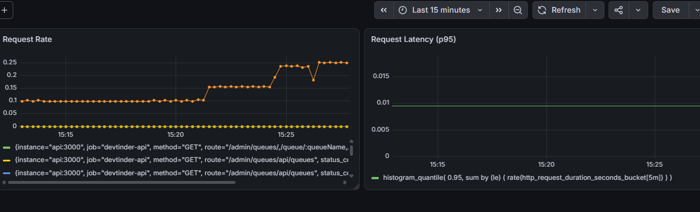
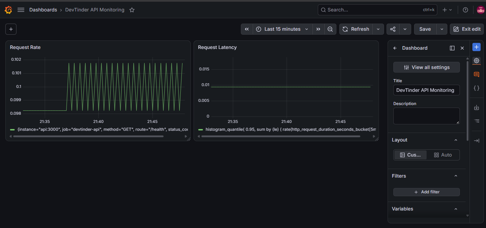

### Performance

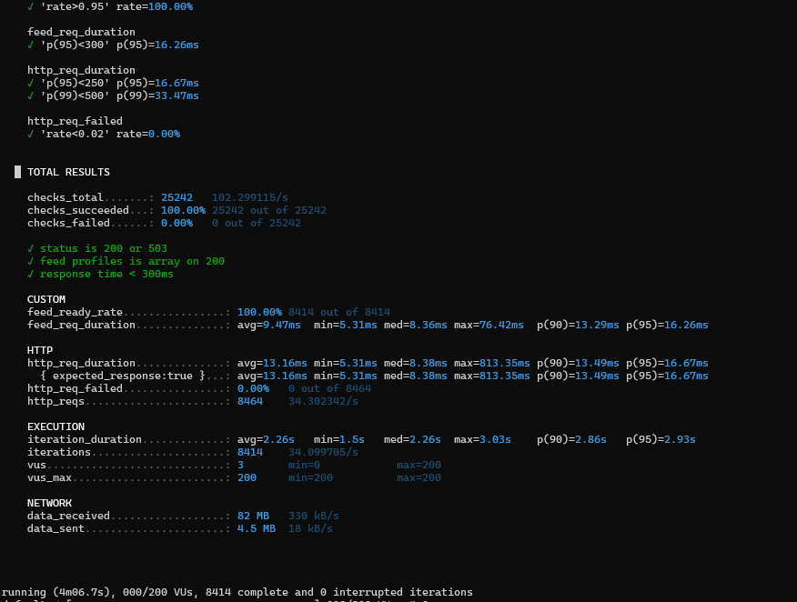

## Testing and Performance

- **Automated tests:** Vitest unit tests cover password and auth utilities plus auth, CSRF, and onboarding middleware. Supertest integration tests exercise auth, onboarding, and feed flows against PostgreSQL and Redis.
- **CI:** the server workflow installs dependencies, applies migrations, seeds reference data, type-checks, tests, and builds before images are published.
- **Load testing:** k6 scenarios cover smoke, authentication, authentication stress, and feed load. The feed baseline used 50 test users, 5,000 candidates, and 10,000 profile actions. At 200 virtual users it recorded about 34.3 requests/sec, 16.26 ms p95, and 0% failed requests.

Those figures are reproducible local baselines, not a production capacity promise. The [feed report](docs/performance/feed.md) documents the dataset, HNSW query plan, and results; the [login report](docs/performance/login.md) documents the bcrypt/CPU-bound login stress tests.

## Production and Monitoring

Production runs the frontend, API, worker, migration job, PostgreSQL, Redis, Prometheus, and Grafana with Docker Compose. Nginx serves the client, terminates TLS, proxies `/v1/` and `/socket.io/`, and handles the ACME challenge path. The API exposes `/health` for process liveness and `/ready` for PostgreSQL/Redis readiness; Prometheus scrapes `/metrics`, and Grafana visualizes request rate and latency.

For VPS provisioning, environment setup, certificates, deployment, rollback, and troubleshooting, see [the deployment runbook](docs/deployment-runbook.md). Keep environment files and credentials out of version control.

## Run Locally

### Prerequisites

- Node.js 24+ and npm
- Docker Desktop, recommended for PostgreSQL and Redis
- Provider credentials only for features you intend to use: email, OAuth, GitHub sync, and embeddings

### Docker Compose

```bash
cd server
cp .env.example .env
# Edit .env with local, non-production values; keep it uncommitted.
docker compose -f docker-compose.yml -f docker-compose.dev.yml up --build
```

The API is available on `http://localhost:3000`, PostgreSQL is mapped to `localhost:5434`, Redis to `localhost:6379`, and the Nginx-served client to `http://localhost`.

In another terminal, apply the schema and seed the required reference data:

```bash
cd server
npm install
npm run db:migrate
npm run db:seed:reference
```

### Run client and server directly

Use this when PostgreSQL and Redis are already running locally.

```bash
# Terminal 1
cd server
cp .env.example .env
npm install
npm run dev

# Terminal 2
cd frontend
cp .env.example .env
npm install
npm run dev
```

The Vite client defaults to `http://localhost:5173`; configure server origins and connection URLs through the supplied example environment files. Start `npm run worker` in `server` to process queues.

### Checks

```bash
cd server
npm run typecheck
npm test

cd ../frontend
npm run lint
npm run build
```

## Project Structure

```text
frontend/                         React client: routes, pages, components, hooks, API services
server/
  src/module/                     Feature modules: routes, controllers, services, repositories, validators
  src/middleware/                 Auth, CSRF, onboarding, validation, rate limits, metrics, errors
  src/queues/                     BullMQ queue definitions
  src/workers/                    Email, embedding, GitHub sync, and matching processors
  src/module/socket/              Socket.IO setup, authentication, and chat events
  src/db/                         Drizzle schema, migrations, seeds, and scripts
  src/__tests__/                  Vitest unit, middleware, and integration tests
  k6/                             Smoke and load-test scenarios
  docker-compose*.yml             Local, development, k6, and production services
docs/
  performance/                    Reproducible feed and login test reports
  deployment-runbook.md           Deployment and rollback runbook
```

## Lessons Learned

- Search performance needs production-shaped data: vector search was tested with candidate profiles and prior interaction records, not an empty feed.
- CPU-bound bcrypt work makes authentication capacity dependent on CPU and Node.js worker-pool configuration; repeatable k6 tests made that constraint visible.
- Background jobs improve request latency but demand explicit state transitions, idempotent job IDs, retry behaviour, and observability.
- Health and readiness are distinct: the API separately reports process health and database/Redis availability.

## Future Improvements

- Add end-to-end browser tests and client-side test coverage.
- Add a Socket.IO adapter before scaling real-time delivery across multiple API instances.
- Extend monitoring with alerting, queue-depth and worker-failure dashboards, and centralized logs.
- Evolve recommendation quality with explicit feedback signals and offline relevance evaluation.
- Add curated, happy-path product screenshots and a public demo when those assets are available.
