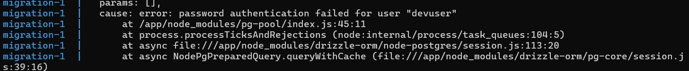
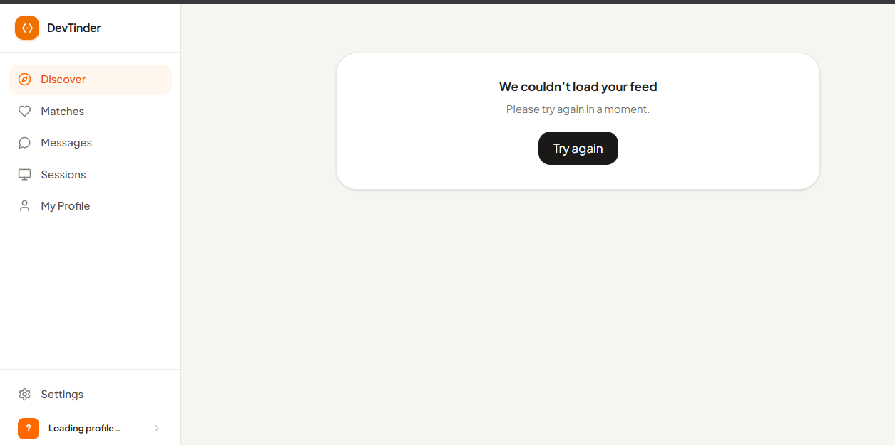
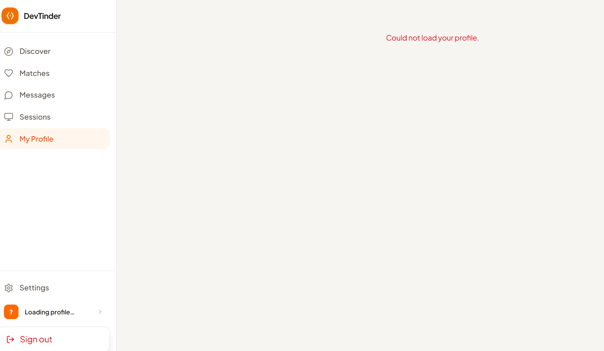
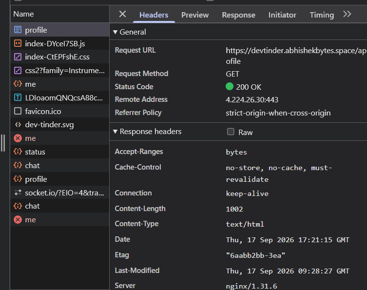
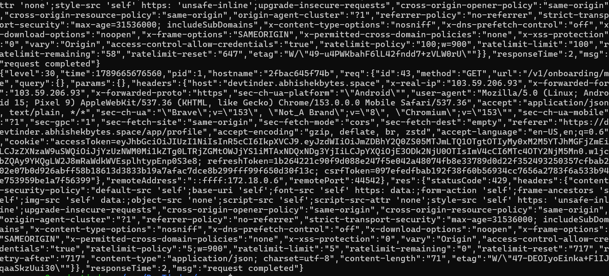
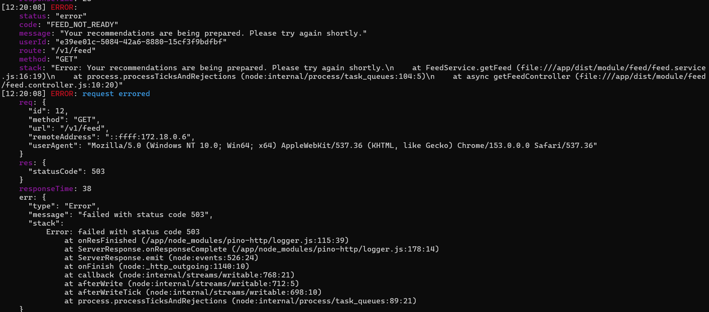
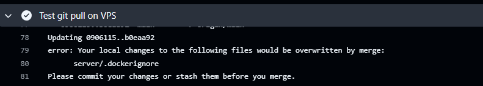
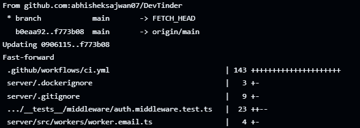
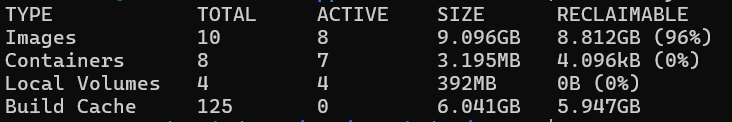
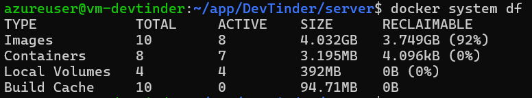

# DevTinder — Deployment Notes

Troubleshooting, mistakes, debugging, explanations, and lessons learned during deployment.

---

## Table of Contents

1. [SSH Key Permissions (Windows)](#1-ssh-key-permissions-windows)
2. [Database Password Mismatch](#2-database-password-mismatch)
3. [Seed File Forgotten](#3-seed-file-forgotten)
4. [Session Revocation and Stale Auth State](#4-session-revocation-and-stale-auth-state)
5. [Onboarding / Profile Rate Limit Exhaustion](#5-onboarding--profile-rate-limit-exhaustion)
6. [Production Logging Exposing Sensitive Data](#6-production-logging-exposing-sensitive-data)
7. [Health Endpoint Path Confusion](#7-health-endpoint-path-confusion)
8. [Feed Returns 503 FEED_NOT_READY](#8-feed-returns-503-feed_not_ready)
9. [Resend.dev Email Configuration](#9-resenddev-email-configuration)
10. [VPS Local Changes Blocking git pull](#10-vps-local-changes-blocking-git-pull)
11. [Certbot Directory Missing from .dockerignore](#11-certbot-directory-missing-from-dockerignore)
12. [Certbot Directory Missing from .gitignore](#12-certbot-directory-missing-from-gitignore)
13. [GitHub Actions Variables Don't Exist on VPS](#13-github-actions-variables-dont-exist-on-vps)
14. [VPS Still Using Locally-Built Image After GHCR Migration](#14-vps-still-using-locally-built-image-after-ghcr-migration)
15. [IMAGE_TAG / REGISTRY "Not Set" Warning](#15-image_tag--registry-not-set-warning)
16. [`--build` Defeats GHCR](#16---build-defeats-ghcr)
17. [git pull via HTTPS with PAT — Not Ideal](#17-git-pull-via-https-with-pat--not-ideal)
18. [Multiple SSH Steps vs Single SSH Session](#18-multiple-ssh-steps-vs-single-ssh-session)
19. [set -e Was Missing](#19-set--e-was-missing)
20. [Triggering CI Without Code Changes](#20-triggering-ci-without-code-changes)
21. [Container Name vs Image Version](#21-container-name-vs-image-version)
22. [Why Docker Images Instead of git pull + build](#22-why-docker-images-instead-of-git-pull--build)
23. [Why Only Application Images Go to GHCR](#23-why-only-application-images-go-to-ghcr)
24. [Redis Memory Observations](#24-redis-memory-observations)
25. [Docker Disk Usage After Repeated Builds](#25-docker-disk-usage-after-repeated-builds)
26. [Production DB Safety — Seeds](#26-production-db-safety--seeds)
27. [drizzle-kit Not in Production Image](#27-drizzle-kit-not-in-production-image)
28. [Validation Notes](#28-validation-notes)
29. [GHCR Cleanup Not Yet Automated](#29-ghcr-cleanup-not-yet-automated)
30. [Old Rollback Approach — Before GHCR](#30-old-rollback-approach--before-ghcr)
31. [Testing Deployment from a Feature Branch — Changes Won't Reach VPS](#31-testing-deployment-from-a-feature-branch--changes-wont-reach-vps)

---

## 1. SSH Key Permissions (Windows)

### Symptom

SSH refused the `.pem` file:

```text
WARNING: UNPROTECTED PRIVATE KEY FILE!
Permissions for '.pem' are too open.
```

### Fix

```powershell
$key = "vm-devtinder_key.pem"
icacls.exe $key /reset
icacls.exe $key /GRANT:r "$($env:USERNAME):(R)"
icacls.exe $key /inheritance:r
```

On Linux/macOS: `chmod 400 vm-devtinder_key.pem`.

### Lesson

Windows doesn't use POSIX file permissions. `icacls` must be used to restrict access to only the current user.

---

## 2. Database Password Mismatch

### Symptom

After first deployment, the API failed to connect to PostgreSQL — password mismatch.



### Cause

The database was created with the old password (from the first `docker compose up`). Later the `.env` was changed with a new password, but the existing PostgreSQL data volume still had the old password.

### Fix

Do **not** change `POSTGRES_PASSWORD` after the database volume has been initialized. If you must change it, either:

- Drop the volume and re-initialize, or
- Change the password inside PostgreSQL directly.

### Lesson

PostgreSQL's `POSTGRES_PASSWORD` env var is only used during initial database creation. Changing it in `.env` after the volume exists has no effect — the volume keeps the original password.

---

## 3. Seed File Forgotten

### Symptom

Various features didn't work because reference data was missing. Had to repeat parts of the deployment process to fix it.

### Cause

The seed file was not run after the initial production deployment. This caused a cascade of issues across features that depend on reference data.

### Fix

Run the seed script:

```bash
npx --no-install tsx src/db/seeds/seed.prod.ts
```

### Lesson

Always run the seed file as part of the initial deployment. Don't rely on remembering — it's in the deployment checklist in the runbook. However, seeds should **not** run blindly on every deployment (they can cause duplicates).

---

## 4. Session Revocation and Stale Auth State

### Symptom

Revoking the active session invalidated the session on the server, but the frontend remained visible with the authenticated app shell. The browser retained stale HttpOnly cookies.



### Cause

The backend revoked the session, but the frontend auth store still contained the persisted user. HttpOnly cookies cannot be removed by frontend JavaScript.

### Fix

- Frontend clears the persisted auth store when `/auth/me` fails.
- Axios response interceptor clears the auth store after a final `401` (including a failed refresh after remote session revocation).
- Protected route redirects to `/signin`.
- Backend clears `accessToken`, `refreshToken`, and `csrfToken` cookies for every `401` response through the global error handler.
- Normal logout continues to revoke the session and clear cookies explicitly.

### Verification

```text
Revoke session
  → next authenticated request
  → 401 response
  → auth store cleared
  → HttpOnly cookies cleared by server
  → redirect to /signin
```

---

## 5. Onboarding / Profile Rate Limit Exhaustion

### Symptom

`GET /v1/onboarding/me` returned `429 Too Many Requests` during normal page loading. TanStack Query also retried `429` responses, making it worse.



### Cause

Several unrelated read routes shared one production Redis rate-limit bucket:

- `/onboarding/me`
- `/onboarding/options`
- `/onboarding/check-username`
- `/profiles/:username`

The original production limit was 5 requests per 15 minutes for the shared bucket. A request to one route consumed capacity for another.



### Fix

- Each route now has its own Redis rate-limit bucket with a separate namespace.
- TanStack Query no longer retries HTTP `429` responses.

Current read limits:

| Route                    | Production   | Development   | Key     |
| ------------------------ | -----------: | ------------: | ------- |
| `/onboarding/me`         | 60 / 15 min  | 500 / 15 min  | User ID |
| `/onboarding/options`    | 60 / 15 min  | 500 / 15 min  | User ID |
| `/onboarding/check-username` | 30 / 15 min | 500 / 15 min | User ID |
| `/profiles/:username`    | 120 / 15 min | 500 / 15 min  | IP address |

### Query behavior

The profile query uses the shared key `['profile', 'me']` in `AppShell` and `ProfilePage`, so TanStack Query deduplicates simultaneous requests. The global query policy retries ordinary failures once, but never retries a `429`.

---

## 6. Production Logging Exposing Sensitive Data

### Symptom

Production logs contained large one-line request/response dumps including headers, cookies, and access tokens — hard to read and a security risk.



### Cause

`pino-http` was configured with only the logger, so it serialized the complete request and response objects.

### Fix

HTTP logging now serializes only:

- Request ID, HTTP method, URL, remote address, user-agent
- Response status code, response time

Pino redacts: authorization headers, cookies, `Set-Cookie`, access tokens, refresh tokens, CSRF tokens.

Pretty logging is controlled by `LOG_PRETTY`:

```env
LOG_PRETTY=false   # structured JSON (production default)
LOG_PRETTY=true    # human-readable (temporary debugging)
```

### Lesson

Existing logs are not reformatted retroactively. If an access token appeared in old logs, revoke or rotate the affected session.

---

## 7. Health Endpoint Path Confusion

### Symptom

Requesting `http://localhost/v1/health` returned `Cannot GET /v1/health`.

### Cause

The health endpoint is mounted at `/health`, not `/v1/health`. The `/v1` prefix is for versioned application APIs.

### Fix

Use the correct endpoint:

```bash
# Inside container
wget -qO- http://localhost:3000/health

# Through Nginx (will 301 to HTTPS then hit the API)
curl https://your-domain/health
```

### Lesson

The health endpoint is a separate infrastructure endpoint, not part of the versioned API. `/v1/health` will always 404.

---

## 8. Feed Returns 503 FEED_NOT_READY

### Symptom

After deployment, the feed API returned `503 FEED_NOT_READY`.



### Cause

The feed needs time to initialize. The frontend hook retries every 2 seconds:

```text
GET /v1/feed → 503 FEED_NOT_READY
        ↓
wait 2 seconds
        ↓
GET /v1/feed again
        ↓
repeat until ready
```

### Fix

This is expected behavior — not a bug. Wait for the feed to become ready.


---

## 9. Resend.dev Email Configuration

### Symptom

OTP emails were not being sent to users after production deployment.

### Cause

The Resend.dev domain was not updated to the production domain. Resend requires the sending domain to be verified and explicitly configured — the local/dev domain doesn't carry over.

### Fix

In the Resend.dev dashboard, update:

- The verified sending domain to match the production domain.
- The API key in the production `.env` if a separate key is used per environment.

### Lesson

When deploying to a new domain, audit every third-party service that has your domain configured — Resend, Google OAuth, GitHub OAuth, etc. Each one needs its own update. Don't assume local config carries over to production.

---

## 10. VPS Local Changes Blocking git pull

### Symptom

GitHub Actions CI/CD passed but `git pull --ff-only` failed on the VPS with:

```text
local changes would be overwritten
```

The VPS was also discovered to be 12 commits behind `origin/main` after the `ci-cd` branch was finally merged.



### Cause

The `.dockerignore` file was edited directly on the VPS, creating local changes that conflicted with `origin/main`.

### Fix

```bash
cd ~/app/DevTinder
git restore server/.dockerignore   # restore the specific file
git status                          # verify clean working tree
```

Check how far behind the VPS is before pulling:

```bash
git log HEAD..origin/main --oneline
```



### Lesson

Never edit tracked files directly on the VPS. All changes go through Git. Untracked files like `certbot/` are fine — just make sure they're in `.gitignore`.

---

## 11. Certbot Directory Missing from .dockerignore

### Symptom

Docker build failed during GitHub Actions CI/CD.


### Cause

The `certbot/` directory was not in `server/.dockerignore`, causing build context issues.

### Fix

Add `certbot/` to `server/.dockerignore`.

### Lesson

Certbot certificates are runtime-mounted into the container. They should not be part of the Docker build context or image. Add this locally and commit it — do not add it directly on the VPS or it creates a tracked file conflict (see §10).

---

## 12. Certbot Directory Missing from .gitignore

### Symptom

`git status` on VPS showed `server/certbot/` as untracked.

### Cause

Let's Encrypt certificates and configuration on the VPS were not gitignored.

### Fix

Add `server/certbot/` to the repository's `.gitignore`. Commit and push from local — do not delete the VPS certificates.

### Lesson

After the VPS pulls the updated `.gitignore`, the existing `server/certbot/` files remain on disk but Git ignores them.

---

## 13. GitHub Actions Variables Don't Exist on VPS

### Symptom

`docker compose pull` failed on the VPS because `IMAGE_TAG` and `REGISTRY` were empty.

### Cause

GitHub Actions workflow-level `env:` variables exist only inside the GitHub Actions runner. They do **not** automatically appear inside the SSH session on the VPS.

### Fix

Explicitly export the variables inside the SSH script:

```bash
export IMAGE_TAG="${{ github.sha }}"
export REGISTRY="ghcr.io/${{ github.repository_owner }}"
```

### Lesson

Any value that Compose needs from the environment must be explicitly set inside the SSH session. GitHub Actions context variables (`github.sha`, `secrets.*`) are interpolated by the runner before the script is sent over SSH — they become literal strings inside the session.

---

## 14. VPS Still Using Locally-Built Image After GHCR Migration

### Symptom

After switching to GHCR, running:

```bash
docker inspect devtinder-api --format '{{.Config.Image}}'
```

returned `server-api` instead of a `ghcr.io/...` image.

### Cause

The VPS had not yet pulled the updated `docker-compose.prod.yml` that references GHCR images. It was still using the old `build:`-based config.

### Fix

Ensure `git pull --ff-only origin main` runs **before** `docker compose pull` in the deployment script.

### Lesson

The VPS must have the updated Compose configuration before pulling images. This is why `git pull` still exists in the GHCR-based deployment — it pulls config, not application code.

---

## 15. IMAGE_TAG / REGISTRY "Not Set" Warning

### Symptom

Running `docker compose config --images` on the VPS showed:

```text
REGISTRY variable is not set
IMAGE_TAG variable is not set
```

### Cause

The variables were not exported in the interactive shell session.

### Fix

Export them before running Compose commands manually:

```bash
export IMAGE_TAG=<SHA>
export REGISTRY=ghcr.io/abhisheksajwan07
```

### Lesson

This warning is **not a deployment failure** — it only occurs in interactive shells where the variables haven't been exported. The CI/CD deployment script always exports them explicitly.

---

## 16. `--build` Defeats GHCR

### Explanation

Old deployment used:

```bash
docker compose up -d --build
```

`--build` tells Docker Compose to build images locally, which defeats the purpose of pulling pre-built GHCR images. The VPS would rebuild from source instead of using the immutable image tied to the commit SHA.

New deployment:

```bash
docker compose pull     # download GHCR images
docker compose up -d    # start containers from pulled images
```

---

## 17. git pull via HTTPS with PAT — Not Ideal

### History

The initial VPS setup cloned the repo via HTTPS and used a GitHub Personal Access Token for authentication.

### Why it was changed

HTTPS + PAT is functional but not ideal for automated deployments:

- PATs expire and need rotation.
- HTTPS credentials can be accidentally stored in Git config.

### Current approach

VPS uses a **deploy key** (SSH key pair):

- Private key on VPS at `~/.ssh/github_deploy`.
- Public key added to GitHub repo → Settings → Deploy keys (read-only).
- Remote changed to `git@github.com:abhisheksajwan07/DevTinder.git`.

---

## 18. Multiple SSH Steps vs Single SSH Session

### History

The initial CI/CD deployment used three separate SSH steps:

```yaml
SSH 1 → deploy
SSH 2 → migration
SSH 3 → health check
```

### Why it broke

Each `appleboy/ssh-action` call opens a **fresh shell session** on the VPS. Variables exported in SSH step 1 — including `IMAGE_TAG` and `REGISTRY` — do not exist in SSH step 2. This caused `docker compose` commands in later steps to fail because the environment was empty.

### Fix

Consolidated into one SSH session so all deployment state and variables stay in the same shell:

```text
One SSH
 ↓ export IMAGE_TAG and REGISTRY
 ↓ git pull
 ↓ docker compose pull
 ↓ docker compose up -d
 ↓ migration
 ↓ health check
```

### Lesson

Don't split a deployment across multiple SSH action steps unless you re-export all required variables in each one. One SSH session per deployment is simpler and avoids this class of problem entirely.

---

## 19. set -e Was Missing

### Symptom

`git pull` failed on VPS but the deployment script continued to Docker deployment anyway.

### Cause

The SSH script did not have `set -e`, so shell errors were silently ignored and execution continued regardless.

### Fix

Added `set -e` at the beginning of the SSH script:

```bash
script: |
  set -e
  cd /home/azureuser/app/DevTinder
  git pull --ff-only origin main
  ...
```

Now:

```text
git pull fails → script stops → Docker deployment does NOT happen → GitHub Actions fails ❌
```

### Lesson

Always use `set -e` in deployment scripts. Without it, partial failures can leave production in an inconsistent state — old code running while the script reports success.

---

## 20. Triggering CI Without Code Changes

### Tip

GitHub Actions won't trigger on a push with no diff. Use an empty commit:

```bash
git commit --allow-empty -m "ci: retrigger test"
git push
```

This was useful during SSH key testing when there was no actual code change to push.


---

## 21. Container Name vs Image Version

### Explanation

These are different concepts:

```text
Container name:  devtinder-frontend     (from Compose: container_name)
Image:           ghcr.io/.../devtinder-frontend:8c9f5c...  (from GHCR tag)
```

During rollback, the container name stays the same. Only the image tag changes.

Initially the frontend container was automatically named `server-frontend-1`. We added `container_name: devtinder-frontend` for a stable, predictable name.

---

## 22. Why Docker Images Instead of git pull + build

### Alternative approach (rejected)

```bash
git pull
npm ci
npm run build
npm start
```

### Why it was rejected

The VPS would need to:

- Have the correct Node version
- Install dependencies
- Compile TypeScript
- Have all build tools
- Deal with dependency differences
- Perform the build during deployment (downtime risk)

With Docker images:

- The build environment is packaged with the application.
- The VPS just runs: `docker pull` + `docker compose up`.
- Each image is an immutable artifact tied to a specific commit.
- Rollback is instant — pull the old image, no rebuild.

---

## 23. Why Only Application Images Go to GHCR

Only `devtinder-server` and `devtinder-frontend` are pushed to GHCR.

Infrastructure services continue using their public images:

```text
pgvector/pgvector:pg17
redis:8-alpine
prom/prometheus
grafana/grafana
```

These are maintained by their respective teams, versioned independently, and don't contain our application code — no reason to rebuild or re-push them.

The backend image is reused by three services with different commands:

```text
api       → node dist/server.js
worker    → node dist/worker.js
migration → node dist/db/migrate.js
```

---

## 24. Redis Memory Observations

From `docker exec devtinder-redis redis-cli -a "$REDIS_PASSWORD" INFO memory`:

| Metric                | Value      | Meaning                              |
| --------------------- | ---------- | ------------------------------------ |
| `used_memory`         | 2.10 MB    | Redis allocated memory               |
| `used_memory_dataset` | ~0.62 MB   | Actual stored data                   |
| `used_memory_peak`    | 2.34 MB    | Highest allocation                   |
| `used_memory_rss`     | 27.32 MB   | OS-level memory                      |
| `maxmemory`           | 0          | No max-memory limit set inside Redis |
| `maxmemory_policy`    | noeviction | Won't auto-evict keys if memory fills |

Docker Compose set a 128 MB container memory limit. Redis was using ~91% of it. Investigate actual usage before increasing the limit.

---

## 25. Docker Disk Usage After Repeated Builds

### Symptom

`docker system df` showed many unused images and build cache consuming several GB.



### Cause

Every `docker compose up -d --build` during deployment practice leaves old layers and cache behind.

### Fix

```bash
docker builder prune    # build cache only
docker image prune      # dangling images only
```



---

## 26. Production DB Safety — Seeds

- Seed scripts should not run blindly on every production deployment.
- Seeds are mainly for initial/reference data; repeated seeds can cause duplicates.
- Always take a DB backup before risky schema/data changes.
- If a migration fails, the migration container exits non-zero and the API won't start.
- Application rollback = deploy previous image.
- Database rollback = reverse schema/data changes — harder, may require restoring a backup.

---

## 27. drizzle-kit Not in Production Image

`drizzle-kit` is in `devDependencies`. The production Docker image runs `npm ci --omit=dev`, so `drizzle-kit` is **not** installed.

Production does **not** use `npx drizzle-kit migrate`. Instead it runs `dist/db/migrate.js` using Drizzle ORM's runtime migration API.

---

## 28. Validation Notes

- Frontend TypeScript build passed with `tsc -b` after the query retry change.
- Server TypeScript check passed after the rate-limit and logging changes.
- Onboarding middleware tests passed.
- One pre-existing auth middleware test does not await the async middleware and can fail independently of these changes.

---

## 29. GHCR Cleanup Not Yet Automated

GHCR image cleanup is intentionally not automated. A retention policy like "keep latest 3" could delete an image needed for rollback.

Current approach: keep all versions while learning/testing rollback.

Later, add a deliberate retention policy (e.g., keep latest 5 releases) only after deciding the rollback retention requirement.

---

## 30. Old Rollback Approach — Before GHCR

Before GHCR, rollback was a **manual VPS procedure**:

1. Find the last known-good commit: `git log --oneline`
2. Checkout that commit: `git checkout <commit>` (detached HEAD)
3. Rebuild: `docker compose -f docker-compose.yml -f docker-compose.prod.yml up -d --build`
4. Health check.
5. Do **not** checkout `main` again while it still contains the broken commit.

### Limitations

- Required rebuilding on the VPS.
- Database migrations were not automatically rolled back.
- Slower than image-based rollback.

This was replaced by the GHCR image-based rollback workflow, which pulls pre-built images without rebuilding.

---

## 31. Testing Deployment from a Feature Branch — Changes Won't Reach VPS

### Symptom

CI/CD was being tested on the `ci-cd` branch. Deployment passed in GitHub Actions but changes were never actually reaching the VPS. After merging `ci-cd` to `main`, the VPS was discovered to be 12 commits behind `origin/main`.

### Cause

The deployment script pulls from `main`:

```bash
git pull --ff-only origin main
```

Pushing to `ci-cd` triggers the workflow, but the VPS pulls `main` — so any changes that only exist on `ci-cd` are never applied to the VPS until the branch is merged.

### Lesson

Testing deployment from a feature branch does **not** prove production works. The workflow may pass, but the VPS is pulling a different branch entirely. Only changes merged to `main` reach the VPS.

After merging a long-running branch, always verify the VPS is actually up to date:

```bash
git log HEAD..origin/main --oneline
```

If this shows commits, the VPS is behind and needs a manual pull or a triggered deployment.
