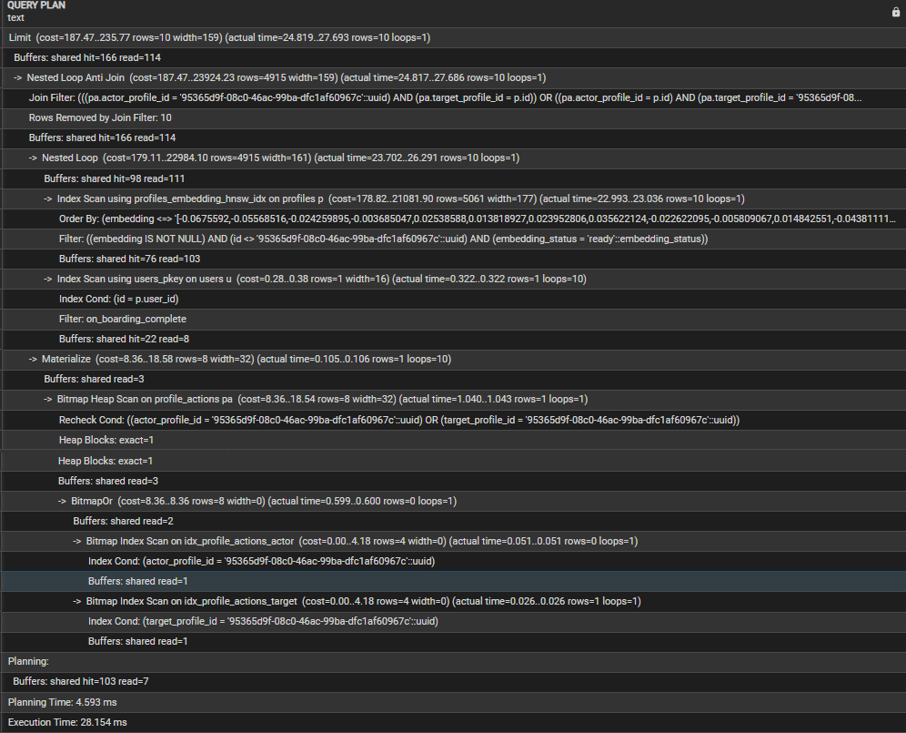
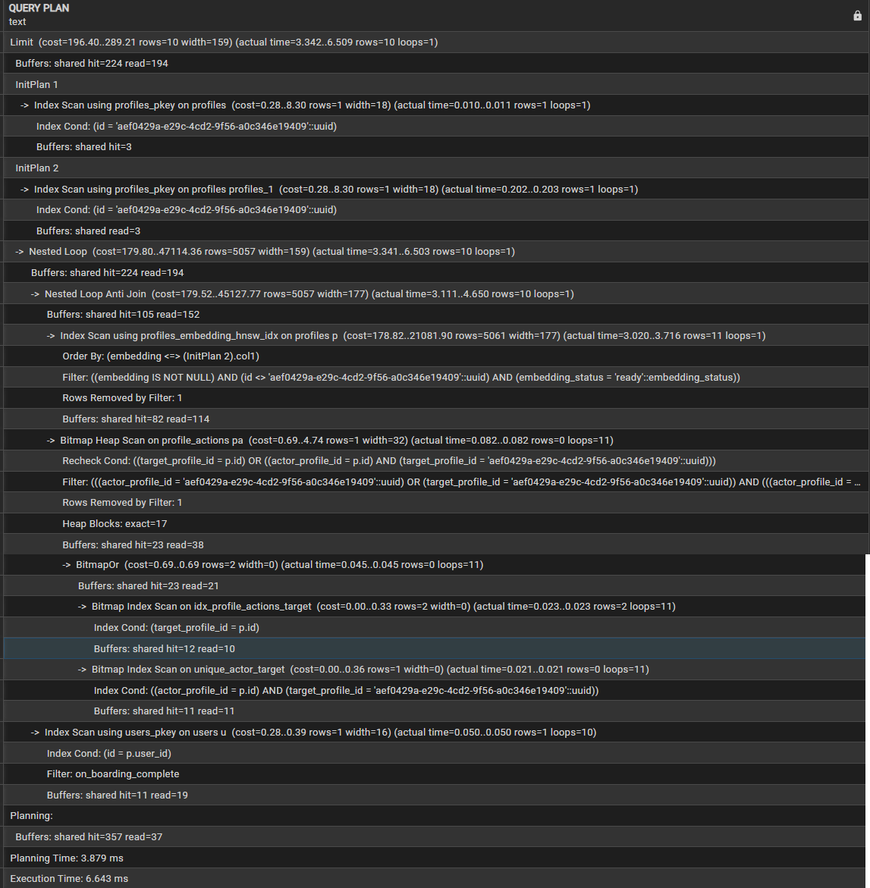

# Feed Performance

This document records a load test for `GET /v1/feed`.

The endpoint finds profiles similar to the logged-in user, removes people they have already interacted with, and returns up to 10 profiles.

## Test setup

- 2 CPU cores
- 2 GB RAM
- PostgreSQL with pgvector
- Redis
- Node.js / Express
- Docker
- k6

## Test data

- 50 logged-in test users
- 5,000 profiles that can appear in the feed
- 10,000 `profile_actions` records
- 1024-value profile embeddings
- An HNSW index on `profiles.embedding`

The action records make the test more realistic because the feed must hide profiles that users have already liked, passed, or otherwise interacted with.

## How the feed query works

The main part of the query is:

```sql
ORDER BY p.embedding <=> viewer_embedding ASC
LIMIT 10
```

In simple terms, it finds the 10 closest profile embeddings. It also:

- skips the current user
- includes only users who finished onboarding
- includes only profiles with an embedding
- hides profiles when either user has already acted on the other

The interaction check uses `NOT EXISTS`.

Important indexes:

```text
profiles_embedding_hnsw_idx
idx_profile_actions_actor
idx_profile_actions_target
unique_actor_target
```

## Load-test result

The final k6 test used 200 virtual users (VUs).

| Metric | Result |
| --- | ---: |
| Maximum VUs | 200 |
| Feed requests | 8,464 |
| Requests per second | ~34.3 |
| p95 response time | 16.26 ms |
| Slowest response | 76.42 ms |
| Failed requests | 0% |
| Successful feed responses | 100% |


## Database check

I used `EXPLAIN (ANALYZE, BUFFERS)` to see how PostgreSQL ran the query.

```text
Index Scan using profiles_embedding_hnsw_idx on profiles p
```

This shows that PostgreSQL used the HNSW index to search for similar profiles. The checks against `profile_actions` also used indexes instead of reading the whole table.



### Before adding action data

The first test had about 5,050 profiles:

- 50 logged-in test users
- 5,000 feed profiles
- no meaningful `profile_actions` data

Result:

```text
Execution Time: 28.154 ms
Buffers: shared hit=166 read=114
```

### With the larger dataset

After adding 10,000 profile actions, one run with less data already in memory gave:

```text
Execution Time: 6.643 ms
Buffers: shared hit=224 read=194
```

A run where the needed data was already in memory gave:

```text
Execution Time: 1.684 ms
Buffers: shared hit=395
```

The difference mostly comes from database caching. These numbers help confirm the query plan, but the k6 result is the more useful result for the full API request.



## Dataset comparison

| Dataset | p95 | Requests/sec | Failures |
| --- | ---: | ---: | ---: |
| 50 users + 5,000 profiles, no meaningful actions | ~17.96 ms | ~34 | 0% |
| 5,000 profiles, repeated pre-action run | ~16.93 ms | ~34.1 | 0% |
| 5,000 profiles + 10,000 actions | 16.26 ms | ~34.3 | 0% |

Adding the larger action dataset did not noticeably slow the feed in this test. Small changes between runs are normal. A larger dataset did not make the query faster; the database cache was different in the `EXPLAIN` runs.

## Embeddings service

Voyage AI creates profile embeddings during onboarding or embedding processing:

```text
Onboarding
    ↓
Voyage AI
    ↓
1024-value embedding
    ↓
PostgreSQL / pgvector
    ↓
GET /v1/feed
    ↓
HNSW similarity search
```

Voyage AI time is not included in the feed test. Each embedding was already stored in PostgreSQL before the request started.

The measured response time mainly covers the API, PostgreSQL, pgvector/HNSW search, and related database work. In production, Voyage AI response time, availability, rate limits, retries, and network conditions can also affect the overall experience.

## Summary

This is a repeatable local baseline, not a promise of production capacity.

With this setup, data, and traffic pattern, the feed endpoint handled about 34 requests per second at up to 200 VUs. Its p95 response time was 16.26 ms, and no requests failed.

The database plan confirmed that both the HNSW vector index and the profile-action indexes were used. Real production results will still depend on database size, cache state, hardware, network delays, connection pooling, background jobs, third-party services, and real user traffic.
