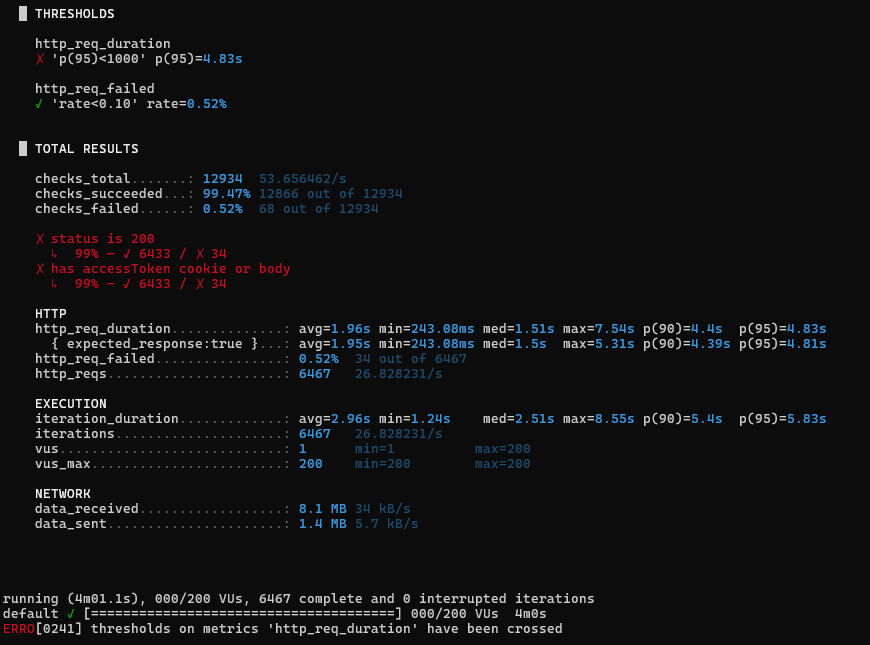
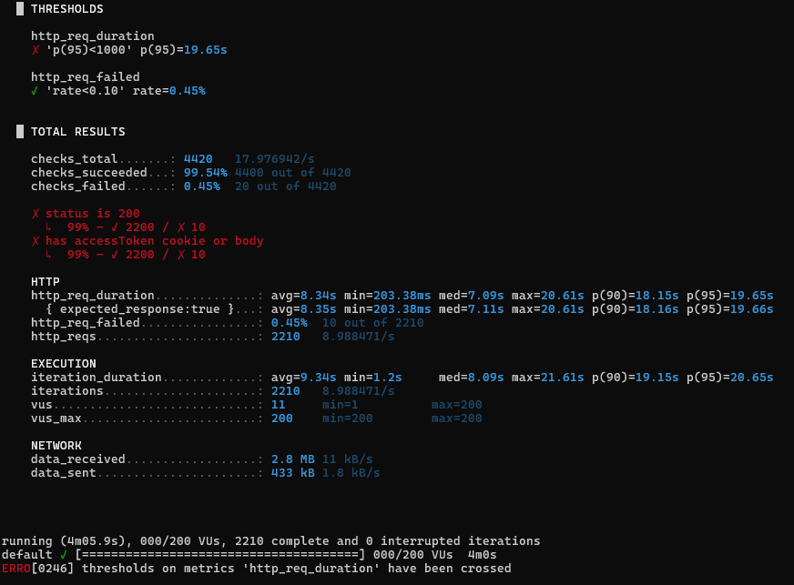
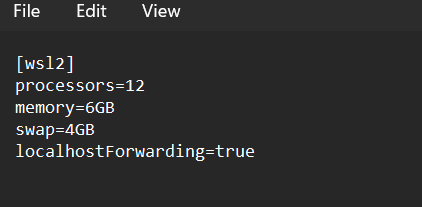
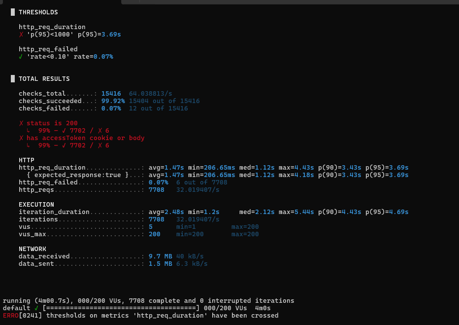

# Login Performance

This document records k6 load tests for the DevTinder login endpoint.

## Endpoint

```text
POST /v1/auth/signin
```

Login checks passwords with bcrypt. That work uses CPU, so response time can increase when many users log in at the same time.

## Test setup

- Node.js and Express
- PostgreSQL
- Redis
- k6
- Docker
- WSL 2
- API, PostgreSQL, Redis, and k6 ran in Docker for the final test
- The worker was stopped during login tests

## Test load

- Normal test: 30 virtual users (VUs)
- Stress test: 200 VUs
- Stress-test length: 4 minutes
- Users increased gradually until the test reached 200 VUs

## Normal load test

Before optimization:

- 634 requests
- 0% failed
- p95: 851.18 ms
- p99: 906.23 ms

After optimization:

- 720 requests
- 0% failed
- p95: 278.37 ms
- p99: 306.18 ms

<!-- Add normal load test screenshot here. -->

## 200 VU stress test

### Round 1: API on the Windows host

PostgreSQL, Redis, and k6 ran in Docker.

- 6,467 requests
- 26.83 requests/sec
- p95: 4.83 sec
- Failed: 0.52%



### Round 2: Everything in Docker

The API, PostgreSQL, Redis, and k6 all ran in Docker.

- 2,210 requests
- 8.99 requests/sec
- p95: 19.65 sec
- Failed: 0.45%

At first, WSL 2 limited Docker to 2 CPUs.



## What caused the slowdown

bcrypt checks passwords securely, but many checks at once need a lot of CPU time. During the stress test, this also put pressure on Node.js's libuv worker pool.

Other issues found during testing:

- Redis rate limiting sometimes returned unexpected 429 responses
- PostgreSQL connections had to wait for the connection pool
- bcrypt put extra load on the libuv worker pool

### WSL settings

- 12 processors
- 6 GB RAM
- 4 GB swap
- `UV_THREADPOOL_SIZE=12`



`UV_THREADPOOL_SIZE` sets the number of workers Node.js can use for jobs such as bcrypt. It does not add more CPU cores.

## Round 3: Docker with 12 CPUs

This used the same Docker setup and the same 200 VU test, but with 12 CPUs available.

- 7,708 requests
- 32.02 requests/sec
- p95: 3.69 sec
- Failed: 0.07%



## Comparison

| Setup | Requests/sec | p95 | Failed |
| --- | ---: | ---: | ---: |
| API on Windows host | 26.83 | 4.83 sec | 0.52% |
| Docker with 2 CPUs | 8.99 | 19.65 sec | 0.45% |
| Docker with 12 CPUs | 32.02 | 3.69 sec | 0.07% |

## Summary

- Load tests can reveal machine and setup limits, not only code problems.
- Very few errors does not always mean the app is fast.
- More CPU made a big difference for bcrypt-heavy login requests.
- `UV_THREADPOOL_SIZE` and CPU count are different settings.
- After a performance change, run the test again to confirm the result.

These are local development results, not production benchmarks.
